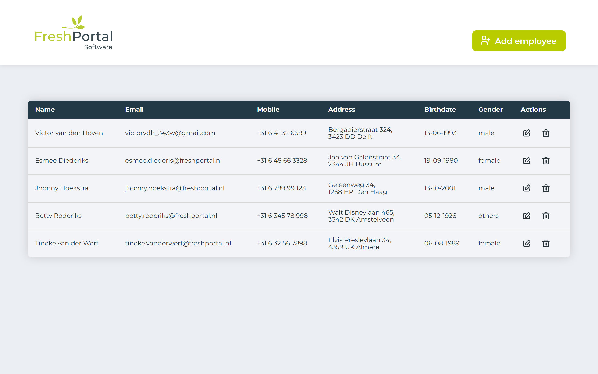

# php CRUD -> MySQL


**`Resources`**

- [php](https://www.php.net/releases/8.2/en.php)
- [best-practice-for-date-of-birth-form-fields](https://medium.com/@h_locke/best-practice-for-date-of-birth-form-fields-91bf67bb3640)
- [youtube: PHP CRUD Operation by Tech Coffee break](https://www.youtube.com/watch?v=gUO56GK0O40)
- [youtube: PHP Full Course for non-haters by Bro Code](https://www.youtube.com/watch?v=zZ6vybT1HQs)

- [php -> sessions](https://www.w3schools.com/php/php_sessions.asp)

---
<br>

Database query:

````
CREATE TABLE employee (
    id INT AUTO_INCREMENT PRIMARY KEY,
    firstname VARCHAR(25),
    lastname VARCHAR(25),
    email VARCHAR(50) NOT NULL UNIQUE,
    mobile VARCHAR(20),
    street VARCHAR(50),
    housenumber VARCHAR(10),
    postalcode VARCHAR(7),
    city VARCHAR(25),
    birthdate DATE,
    gender VARCHAR(6),    
    reg_date TIMESTAMP DEFAULT CURRENT_TIMESTAMP
);

````
---


<br>

**`preview`**





